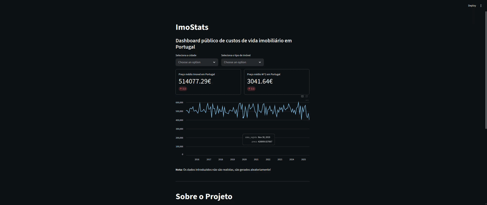

# ImoStats-Portugal
Dashboard público sobre custos de vida no setor imobiliário em Portugal, desenvolvido em Python com sqlite3 e streamlit.

## 📊 Visão Geral
O ImoStats-Portugal é uma aplicação interativa que apresenta dados sobre preços de imóveis e valores do mercado imobiliário nas principais regiões de Portugal. O objetivo é disponibilizar uma ferramenta acessível para análise de custo de vida relacionada à habitação.

## 🚀 Tecnologias Utilizadas
Python — linguagem principal do projeto

Streamlit — criação do dashboard e interface web interativa

SQLite3 — armazenamento leve e eficiente dos dados locais

## 🧰 Funcionalidades
Visualização de preços médios por região, tipo e subtipo de imóvel

## 🔧 Como Executar em Linux
### Instalar dependências (usar um ambiente virtual é recomendado)
python3 -m venv venv

source venv/bin/activate

pip install streamlit

-- deactivate (pra sair de ambiente virtual)

### Iniciar a aplicação
streamlit run main.py

---
## 📌 Contribuições
Ficas à vontade para propor melhorias ou abrir issues! Sugestões e contribuições são mais do que bem-vindas para tornar este projeto ainda mais útil para todos.
